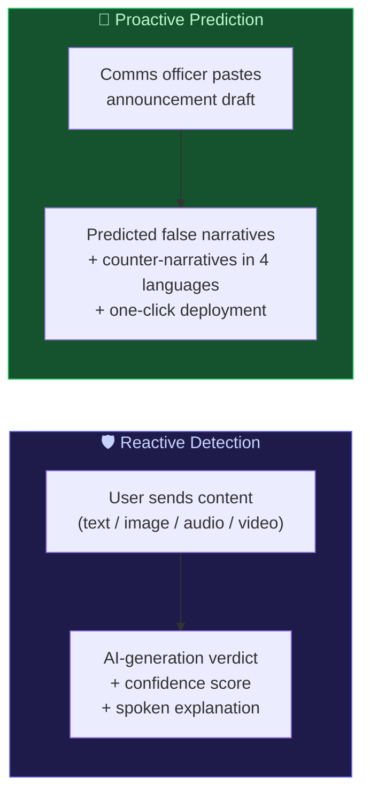
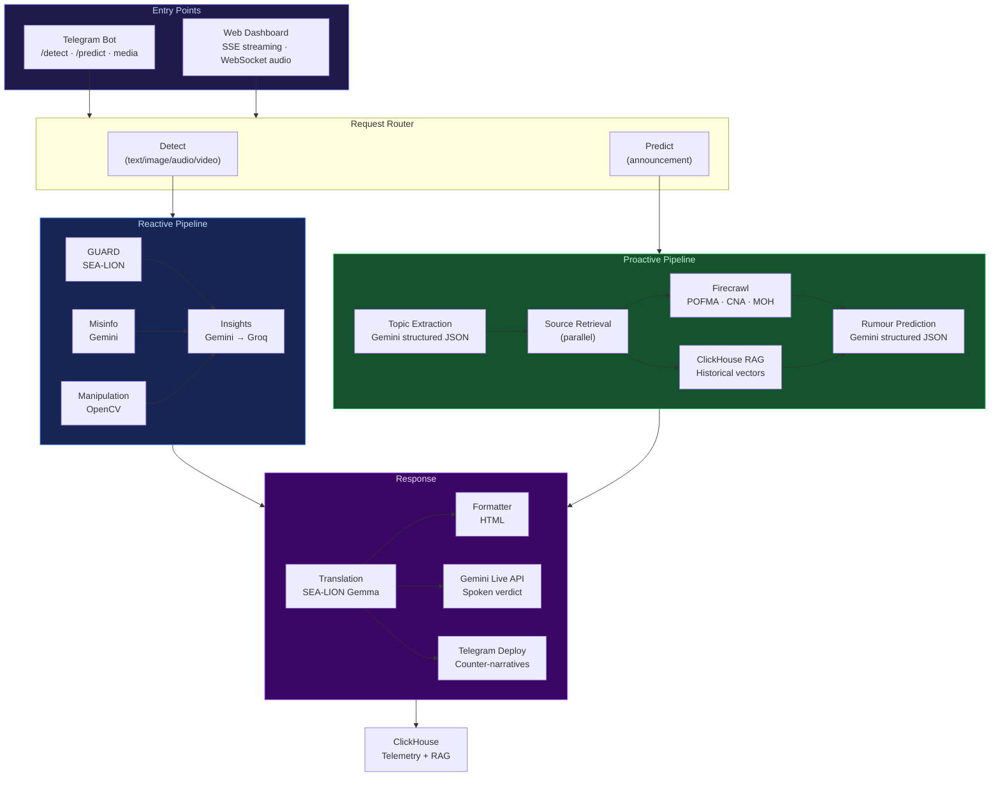
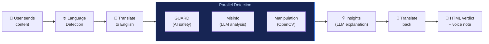
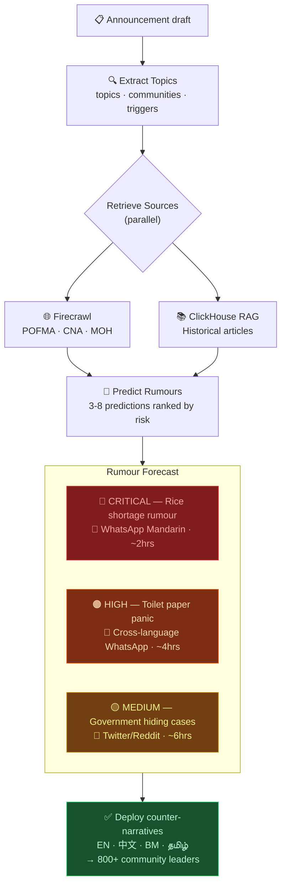
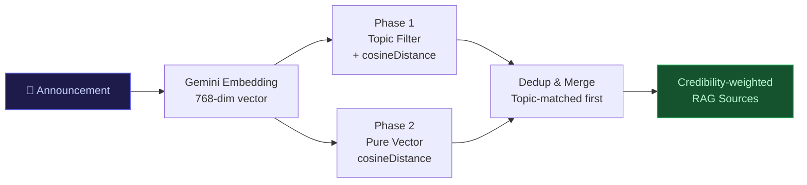

# SENTINEL

### Full-Spectrum Information Integrity Platform for Singapore

> **Gemini Live Agent Challenge:** A multimodal AI content detection system that analyses text, images, audio, and video for signs of AI generation, misinformation, and manipulation — and proactively predicts what misinformation will emerge from official announcements before it spreads.

---

## The Problem

Singapore faces two information integrity challenges:

1. **Reactive gap** — Fact-checking happens *after* misinformation has already spread. Users receive forwarded voice notes, manipulated images, and AI-generated text with no way to verify them quickly.

2. **Proactive gap** — Every government announcement creates an information vacuum. In February 2020, a DORSCON Orange advisory led to rice-shortage rumours on WhatsApp within 2 hours. MOH's correction came 8 hours too late — 300,000 people had already panic-bought.

## Our Solution

SENTINEL closes both gaps:



---

## Tech Stack

| Layer | Technology | Purpose |
|-------|-----------|---------|
| **Runtime** | Python 3.11+ | Async-first backend |
| **Bot** | python-telegram-bot ≥21.0 | Telegram handlers (primary interface) |
| **Web** | FastAPI + Uvicorn | REST, SSE streaming, WebSocket |
| **Primary LLM** | Gemini 2.5 Flash | Detection, prediction, counter-narratives |
| **Live Audio** | Gemini 2.5 Flash Native Audio | Bidirectional STT+TTS via WebSocket |
| **Safety Guard** | SEA-LION GUARD (AI Singapore) | AI-generation + safety classification |
| **Translation** | SEA-LION Gemma 27B-IT | EN↔ZH/MS/TA/Singlish |
| **Embeddings** | Gemini `embedding-001` | 768-dim vectors for RAG |
| **Database** | ClickHouse | Telemetry + vector search (cosineDistance) |
| **Speech** | Deepgram Nova-2 / ElevenLabs | STT + TTS (fallback) |
| **Vision** | Gemini Vision + OpenCV + Tesseract | OCR, manipulation, frame analysis |
| **Scraping** | Firecrawl | POFMA, CNA, MOH source retrieval |
| **Hosting** | Google Cloud Run | asia-southeast1, managed containers |

---

## Architecture



---

## How It Works

### Reactive Detection

Users send content via Telegram or the web dashboard. SENTINEL detects AI-generated content, misinformation, and image manipulation using parallel detection modules, then returns a verdict with confidence score and explanation — including a spoken verdict via Gemini Live API for voice notes.



**Supported inputs:**
- **Text** — Direct messages or `/detect <text>` command
- **Images** — Gemini Vision OCR + AI-signal detection + OpenCV manipulation heuristics
- **Audio** — Deepgram STT → detection pipeline → Gemini Live API spoken verdict
- **Video** — OpenCV frame extraction → Gemini Vision per-frame → audio transcription

### Proactive Prediction

Communications officers paste an official announcement and receive a rumour forecast — predicted false narratives ranked by virality risk, with counter-narratives ready in 4 languages.



### Hybrid RAG

SENTINEL uses a two-phase RAG approach combining topic relevance with vector similarity over a ClickHouse-hosted corpus of Singapore misinformation articles:



**Credibility scoring:** Government (0.95) > Established media (0.90) > Forums (0.70) > Community (0.50). High-credibility sources inform counter-narratives; low-credibility sources reveal actual rumour language patterns.

---

## Getting Started

### Prerequisites

- Python 3.11+
- ffmpeg (for audio/video processing)
- ClickHouse instance (local or [ClickHouse Cloud](https://clickhouse.cloud))

### Installation

```bash
# Clone the repository
git clone https://github.com/your-username/sentinel.git
cd sentinel

# Create virtual environment
python -m venv .venv
.venv\Scripts\activate      # Windows
# source .venv/bin/activate  # macOS/Linux

# Install dependencies
pip install -r requirements.txt
```

### Environment Variables

Copy `.env.example` to `.env` and fill in:

```env
# Required
TELEGRAM_TOKEN=              # from @BotFather
GEMINI_API_KEY=              # Google AI Studio
OPENAI_API_KEY=              # SEA-LION API key

# Recommended
GROQ_API_KEY=                # Fallback LLM
DEEPGRAM_API_KEY=            # Audio transcription
ELEVENLABS_API_KEY=          # TTS fallback
FIRECRAWL_API_KEY=           # Web research + source retrieval
CLICKHOUSE_HOST=             # Telemetry + RAG
CLICKHOUSE_PASSWORD=
```

Full variable list: see [TECHNICAL_DETAILS.md](TECHNICAL_DETAILS.md#environment-variables).

### Run the Bot

```bash
python telegram_bot.py
```

### Run the Web Dashboard

```bash
uvicorn app:app --host 0.0.0.0 --port 8080
```

Open [http://localhost:8080](http://localhost:8080) to access the dashboard.

### Run Tests

```bash
python -m pytest tests/ -v
```

---

## Telegram Commands

| Command | Description |
|---------|-------------|
| `/start` | Welcome message |
| `/help` | Usage instructions |
| `/detect <text>` | Analyse text for AI generation |
| `/research <query>` | Web research and summarisation |
| `/predict <text>` | Rumour forecast from announcement |
| `/deploy` | Push counter-narratives to community channels |
| *(send photo)* | Image OCR + AI detection + manipulation |
| *(send voice)* | Transcribe + detect + spoken verdict |
| *(send video)* | Frame + audio analysis |

---

## Hackathon Compliance

SENTINEL is built for the **Gemini Live Agent Challenge** (Live Agents category).

| Requirement | Implementation | Evidence |
|---|---|---|
| Gemini model | `gemini-2.5-flash` + `gemini-2.5-flash-native-audio-latest` | `config.py` |
| Google GenAI SDK | `from google import genai` | `media/live.py`, `pipeline/insights.py` |
| Google ADK | Agent SDK runner | `pipeline/sdk_runner.py` |
| Google Cloud service | Cloud Run (asia-southeast1) | `Dockerfile`, `cloudbuild.yaml` |
| Gemini Live API | Bidirectional audio WebSocket | `media/live.py` |
| Multimodal I/O | Text, image, audio, video in → verdict + voice out | `telegram_bot.py` |
| Real-time, interruptible | Live API with `end_of_turn` signalling | `media/live.py` |

### Deploy to Cloud Run

```bash
gcloud auth login
gcloud config set project YOUR_PROJECT_ID
gcloud config set run/region asia-southeast1

gcloud run deploy sentinel \
  --source . \
  --region asia-southeast1 \
  --memory 2Gi --cpu 2 --timeout 300 \
  --set-env-vars "TELEGRAM_TOKEN=$TELEGRAM_TOKEN" \
  --set-env-vars "GEMINI_API_KEY=$GEMINI_API_KEY" \
  --set-env-vars "OPENAI_API_KEY=$OPENAI_API_KEY"
```

### Verify

```bash
python verify_hackathon.py   # 45+ offline code checks
python verify_gcp.py         # Cloud Run environment check
```

---

## Project Structure

```
sentinel/
├── telegram_bot.py           # Telegram handlers (primary entry point)
├── app.py                    # FastAPI web server + dashboard
├── config.py                 # Single env-var access point
├── Dockerfile                # Cloud Run container
├── cloudbuild.yaml           # CI/CD pipeline
├── requirements.txt
│
├── pipeline/                 # Core detection + prediction logic
│   ├── detector.py           #   orchestrates GUARD + misinfo + manipulation
│   ├── guard.py              #   SEA-LION GUARD safety classification
│   ├── insights.py           #   LLM gateway (Gemini → Groq fallback)
│   ├── translator.py         #   SEA-LION Gemma translation (EN↔ZH/MS/TA)
│   ├── formatter.py          #   HTML formatting (parse_mode="HTML" only)
│   ├── logger.py             #   ClickHouse non-blocking telemetry
│   ├── predictor.py          #   NEW: rumour prediction engine
│   ├── embeddings.py         #   NEW: Gemini embedding-001 (768-dim)
│   ├── rag.py                #   NEW: hybrid ClickHouse vector search
│   ├── deployer.py           #   NEW: Telegram counter-narrative push
│   └── sdk_runner.py         #   ADK singleton runner
│
├── media/                    # Multimodal processing
│   ├── image.py              #   OCR + manipulation detection
│   ├── audio.py              #   Deepgram STT + ElevenLabs TTS
│   ├── live.py               #   Gemini Live API (bidirectional audio)
│   └── video.py              #   OpenCV + ffmpeg
│
├── research_agent/           # Web research subagent
│   ├── agent.py              #   orchestration
│   ├── crawler.py            #   Firecrawl API wrapper
│   ├── summariser.py         #   LLM summarisation
│   └── skill_cache.py        #   Jaccard similarity cache
│
├── static/
│   └── index.html            # Web dashboard SPA
│
├── db/
│   └── sql/                  # ClickHouse schema
│       ├── 00_create_db.sql
│       ├── 01_detection_events.sql
│       ├── 02_materialized_views.sql
│       └── 03_article_embeddings.sql  # NEW
│
├── tests/                    # pytest + pytest-asyncio
│   ├── test_guard.py
│   ├── test_insights.py
│   ├── test_translator.py
│   ├── test_formatter.py
│   ├── test_audio.py
│   ├── test_live.py
│   ├── test_logger.py
│   ├── test_research_agent.py
│   └── test_predictor.py     # NEW
│
├── research/                 # Generated research outputs
│   ├── raw/
│   ├── skills/
│   └── summaries/
│
├── verify_hackathon.py       # Hackathon compliance checker
└── verify_gcp.py             # Cloud Run env check
```

---

## Key Technical Decisions

1. **Reactive + proactive in one platform** — Instead of two tools, SENTINEL handles both content detection and rumour prediction through shared Gemini, ClickHouse, Firecrawl, and Telegram infrastructure.

2. **SEA-LION for Singapore context** — AI Singapore's models are trained on Southeast Asian languages and cultural context, outperforming generic models for Singlish, Mandarin, Malay, and Tamil.

3. **Gemini Live API for voice verdicts** — Single bidirectional WebSocket replaces a three-step STT→LLM→TTS pipeline, reducing latency and satisfying the hackathon's Live Agents requirement.

4. **ClickHouse for everything** — One database for telemetry (SummingMergeTree), vector search (cosineDistance on Array(Float32)), and RAG — no separate vector DB needed.

5. **Hybrid RAG** — Topic filtering + vector similarity improves precision for Singapore-specific misinformation vs pure embedding search.

6. **Never-raise contract** — All detection and prediction functions return structured dicts on failure. No exceptions propagate to handlers. The bot stays up even when individual APIs go down.

---

## Documentation

| Document | Description |
|----------|-------------|
| [TECHNICAL_DETAILS.md](TECHNICAL_DETAILS.md) | Architecture, data flows, schemas, technical decisions |
| [PRODUCT_SPEC.md](PRODUCT_SPEC.md) | Feature inventory, user flows, data structures, demo scenarios |
| [CLAUDE.md](CLAUDE.md) | AI assistant instructions and code rules |

---

*SENTINEL — Detect the threat. Predict the rumour. Protect the community.*
